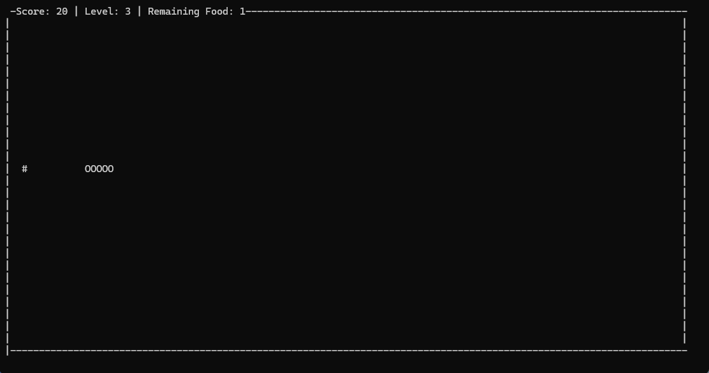

# Snake Game in Terminal

This is a classic Snake game implemented in Python that runs in the terminal. The game includes multiple levels, increasing speed, and scoring. Each level starts with 100 food items(In ***line 48***, you can change the ```food_count``` parameter to specify the number of food to be displayed at any level.), and the snake progresses to the next level after consuming all the food items. The game ends if the snake collides with itself.

## Features

- Snake can pass through walls and appear on the opposite side.
- The game includes levels and score tracking.
- The snake's speed increases with each level.
- A congratulatory message is displayed upon leveling up.
- Level and score information is displayed on the screen.
  
  

## Requirements

- Python 3.x
- `curses` module (For Windows, install `windows-curses`)
  ```sh
  pip install windows-curses
  ```

## Installation

1. Clone the repository:
   ```sh
   git clone https://github.com/yourusername/snake-game-terminal.git
   ```

2. Navigate to the project directory:
    ```sh
    cd snake-game-terminal
    ```

3. (Windows Only) Install the windows-curses module:
   ```sh
   pip install windows-curses
   ```

## Usage
To start the game, run the following command:
  ```sh
   python snake_game.py
   ```

## How to Play
- Use the arrow keys to move the snake.
- Collect food (*) to grow the snake and increase your score.
- The game starts at Level 1. Each level has 100 food items.
- The snake's speed increases with each level.
- A congratulatory message will be displayed when you advance to the next level.
- The game ends if the snake collides with itself.

## Contributing
Feel free to submit issues and enhancement requests.

## License
This project is licensed under the MIT License.

## Contact
For any inquiries, please contact me at tahaasann@gmail.com

**Enjoy the game and happy coding!**

